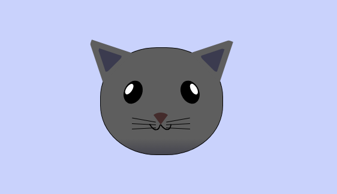

# Gato Gris

Este dibujo representa a un gato, creado usando solo HTML y CSS.

## Imagen

## Archivos

- `gatoGris.html`: Contiene la estructura HTML del dibujo.
- `styles.css`: Contiene los estilos CSS necesarios para el dibujo.
