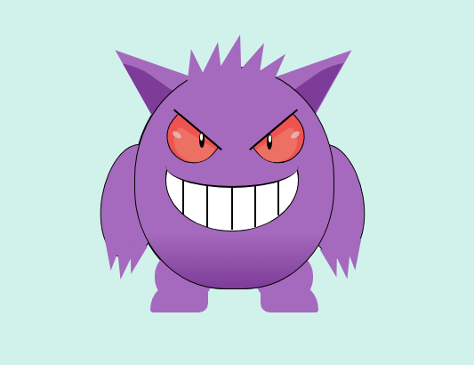

# Gengar

Este dibujo representa a un pokemon llamado gengar, creado usando solo HTML y CSS.
No se si hubo una parte mas dificil que otra pero lo que mas tiempo me llevo fueron las piernas.

## Imagen

## Archivos

- `gengar.html`: Contiene la estructura HTML del dibujo.
- `styles.css`: Contiene los estilos CSS necesarios para el dibujo.

## Referencia

